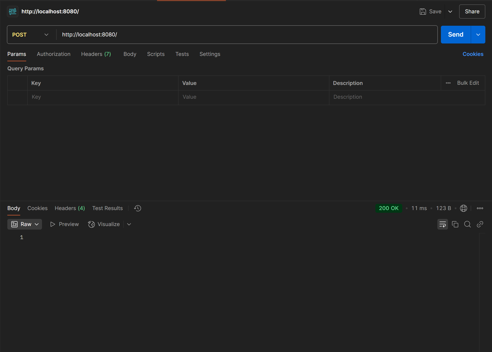
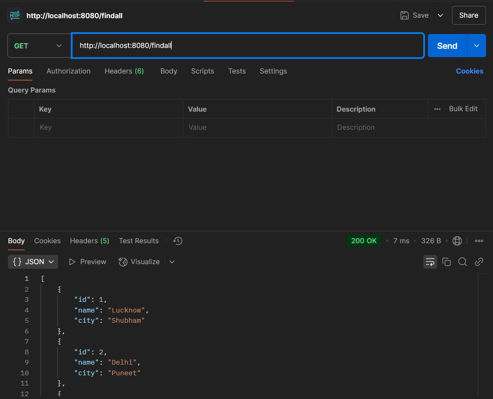
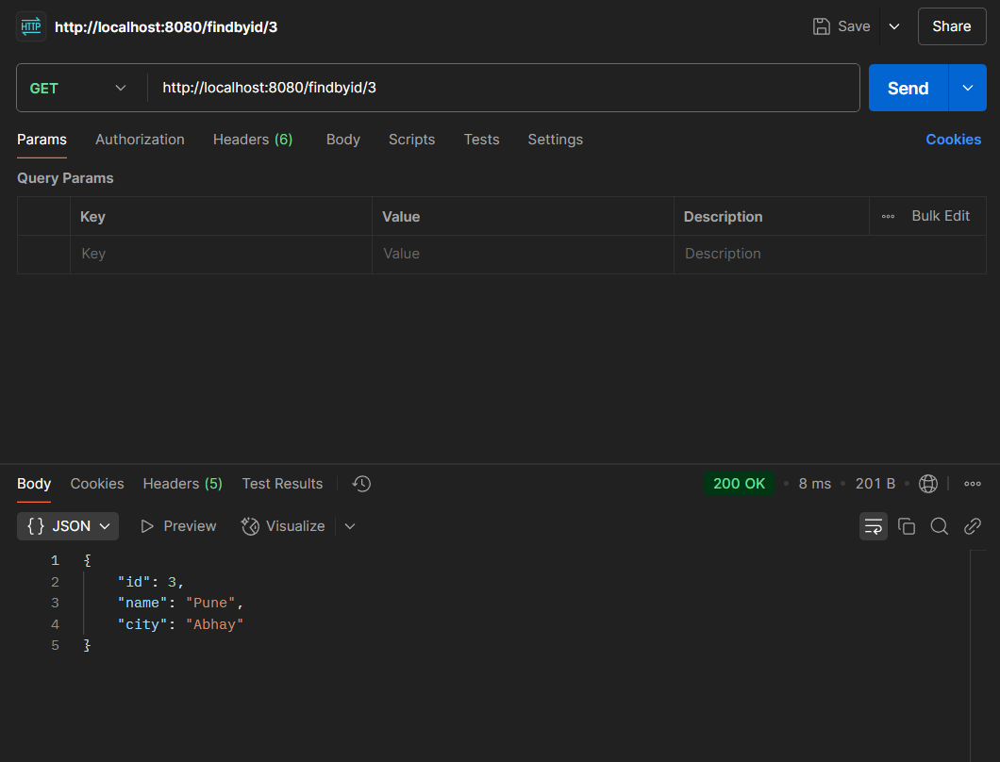
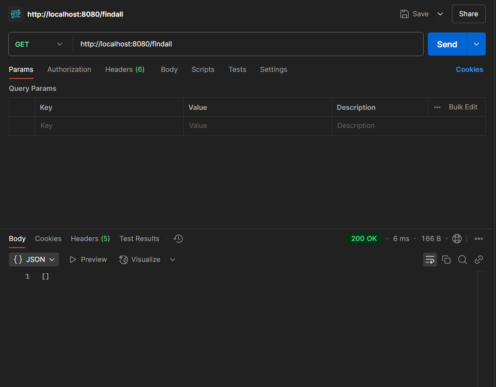

# Employee Management API

This is a simple Employee Management API that allows you to manage employee data. The following operations are available:

## 1. Save Employee Data
- This functionality allows you to add employee data to the database.

## 2. Find All Employee List
- Retrieve a list of all employees stored in the database.

## 3. Find an Employee by ID
- Retrieve a specific employee's information by their unique ID.

## 4. Delete All Employee
- Delete all employees stored in the database.

### Check Result After Deletion
- After deleting all employees, you can verify that the employee list is empty by calling the **Find All Employee List** endpoint.

