# Securing a Web Application

Name: Phạm Văn Đức  
StudentID: 22024561

## Overview
This project demonstrates how to secure a web application using Spring Boot and Spring Security. It provides basic authentication and authorization features, utilizing a simple in-memory user store.

## Key Features
- User authentication and authorization
- Custom login page
- In-memory user store
- Thymeleaf templates for the user interface

## Installation Guide
1. Create a database name `securitydb`

2. Build the project using Maven:
    ```sh
    mvn clean install
    ```

3. Run the application:
    ```sh
    mvn spring-boot:run
    ```

## Usage Guide
- Access the application at `http://localhost:8080`
- Log in with the following credentials:
  - User:
      - Username: `user`
      - Password: `user123`
  - Admin:
      - Username: `admin`
      - Password: `admin123`
  - SuperAdmin: Role Admin and User
      - Username: `superadmin`
      - Password: `superadmin123`

## Extend Version
### Store data in DataBase and BCryptPasswordEncoder
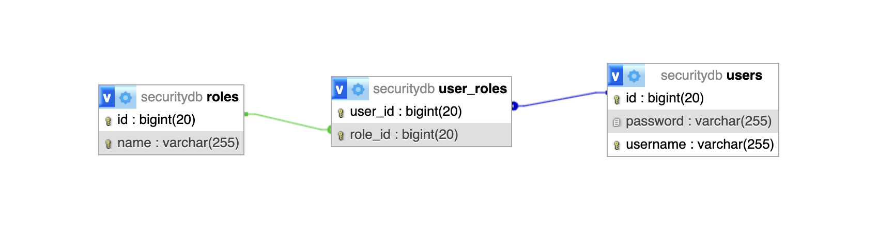
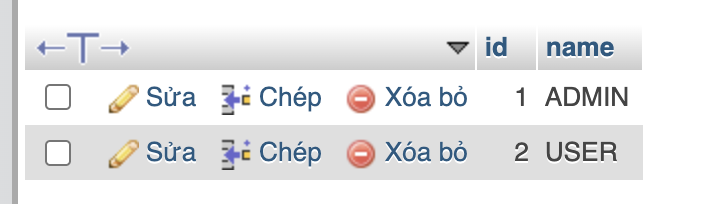
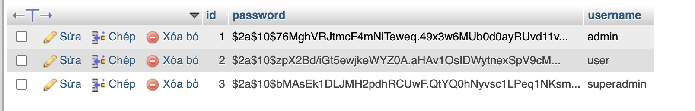
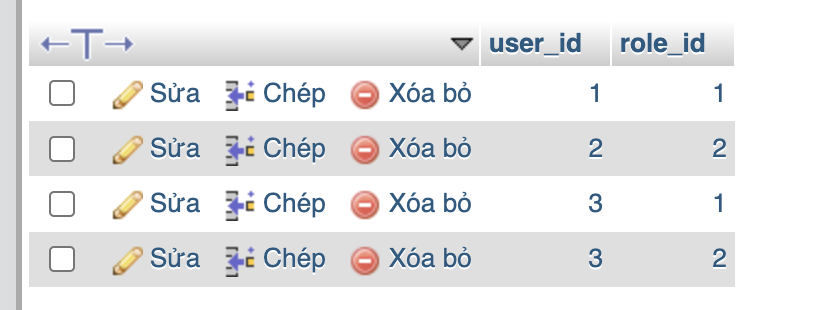

### Authentication and Authorization
| Path        | Access Role    | Description                     |
|-------------|--------------|---------------------------------|
| `/` or `/home` | Everyone    | No authentication required      |
| `/admin`    | Only ADMIN    | Only ADMIN users can access     |
| `/user`     | Only USER     | Only USER users can access      |
| `/hello`    | USER & ADMIN  | Both ADMIN and USER can access  |
| Other paths | Authenticated users | Requires login to access |

### User
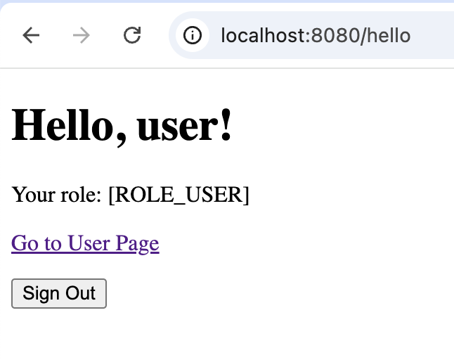
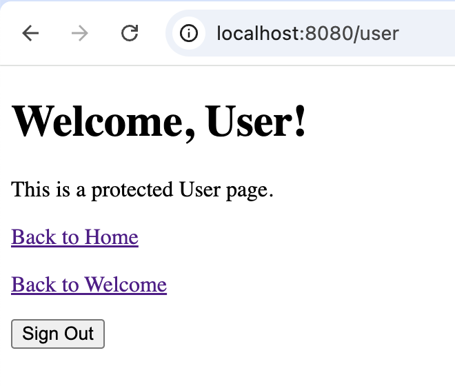
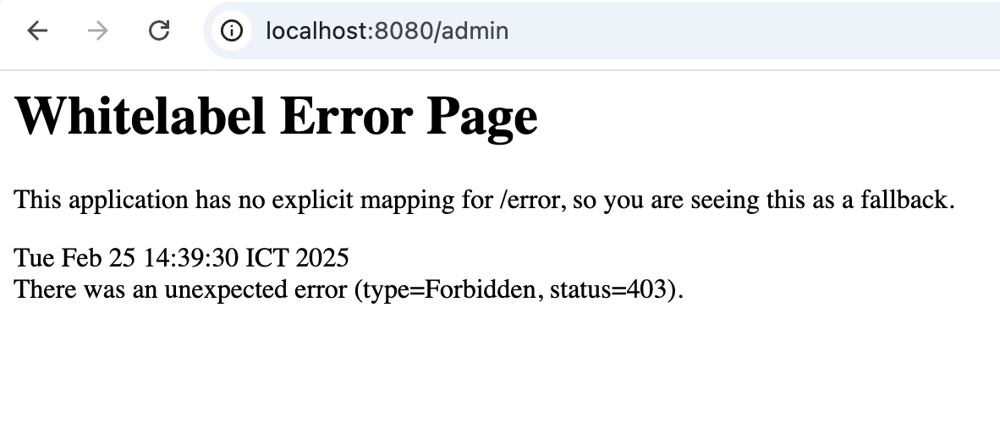
### Admin 
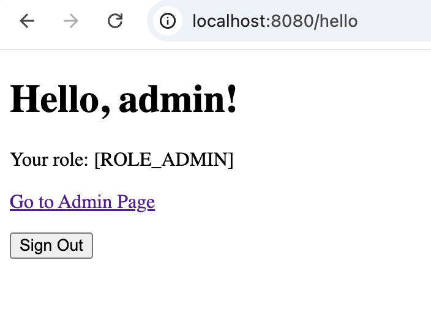
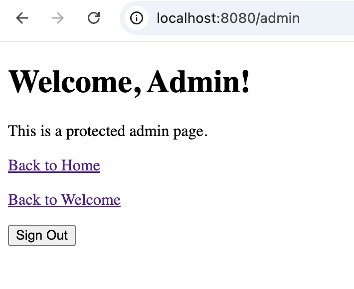
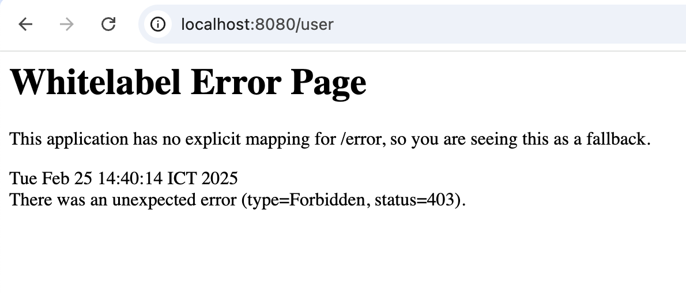
### SuperAdmin
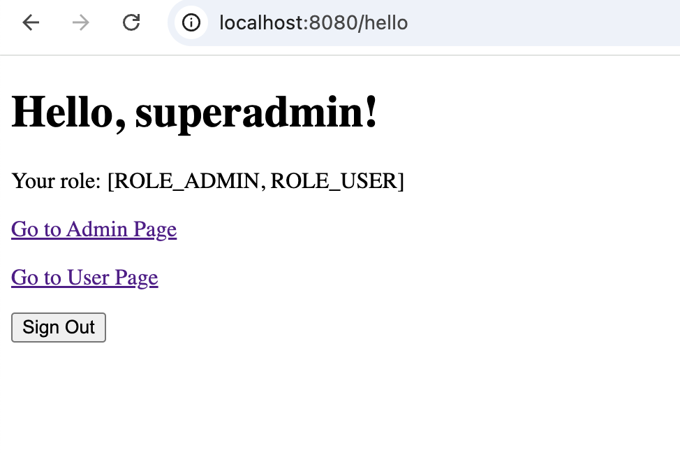
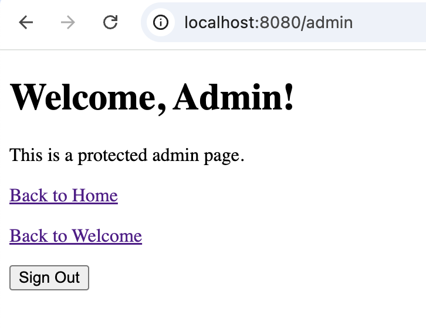
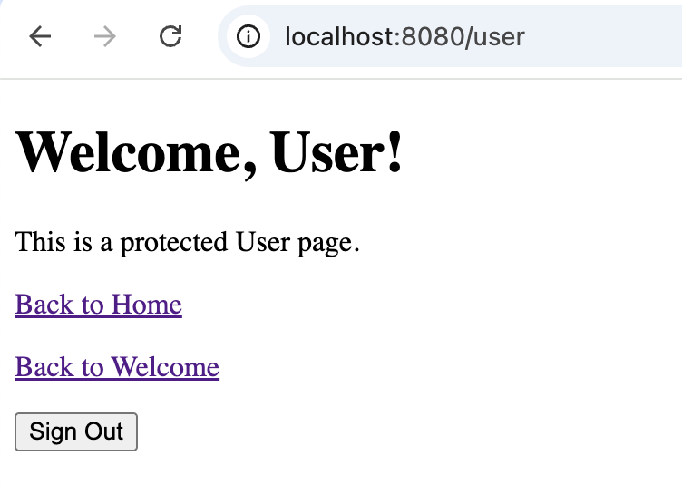
