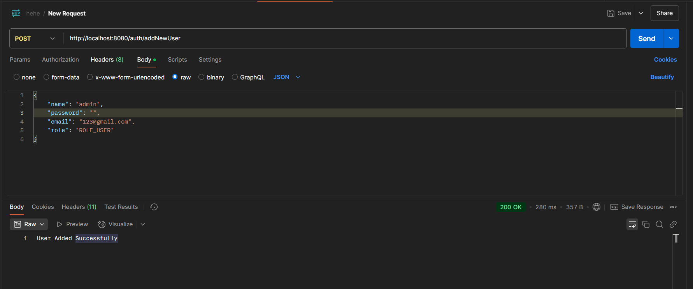
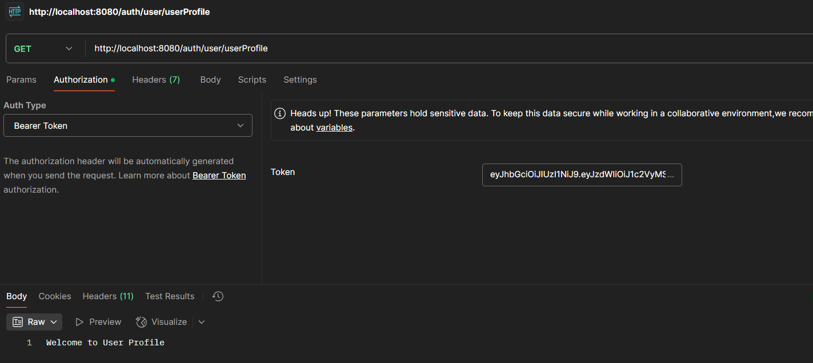
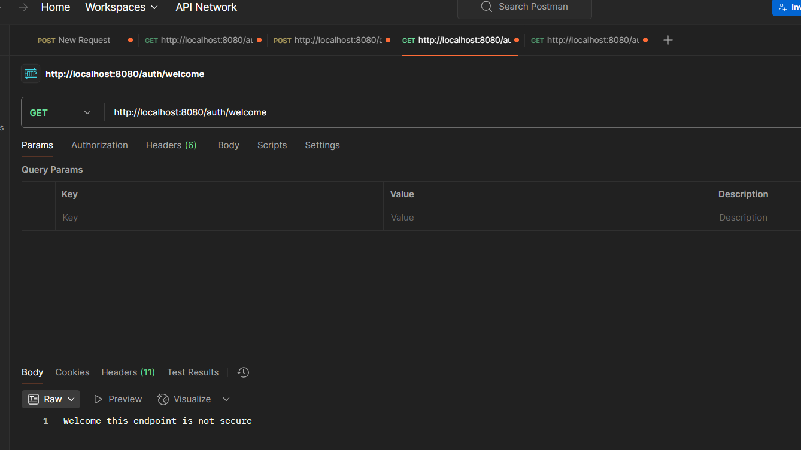

### API Endpoints

- `POST /auth/addNewUser` - Register a new user
- `POST /auth/generateToken` - Authenticate and get a JWT token
- `GET /auth/welcome` - Public endpoint
- `GET /auth/user/userProfile` - User profile (requires ROLE_USER)
- `GET /auth/admin/adminProfile` - Admin profile (requires ROLE_ADMIN)
- `POST /api/admin/create` - Create a new resource (requires ROLE_ADMIN)
- `PUT /api/admin/update` - Update a resource (requires ROLE_ADMIN)
- `DELETE /api/admin/delete` - Delete a resource (requires ROLE_ADMIN)
- `GET /api/user/profile` - Get user profile information (requires ROLE_USER)

## Demo

### Add New User

### Generate Token

### User Welcome Page With JWT

### Welcome Page Without JWT

### Cannot Access Admin Welcome Page Without JWT

